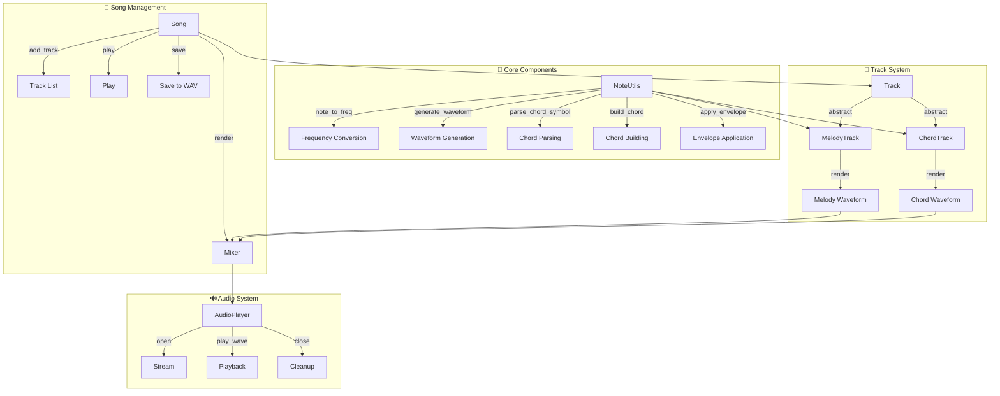
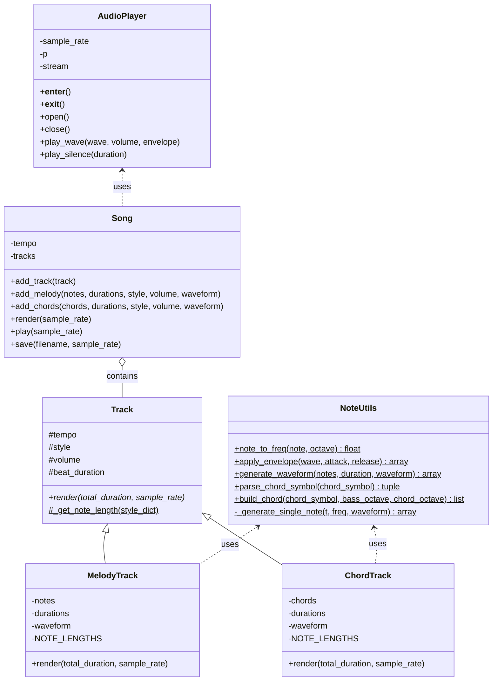
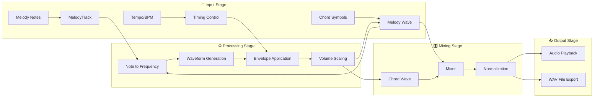
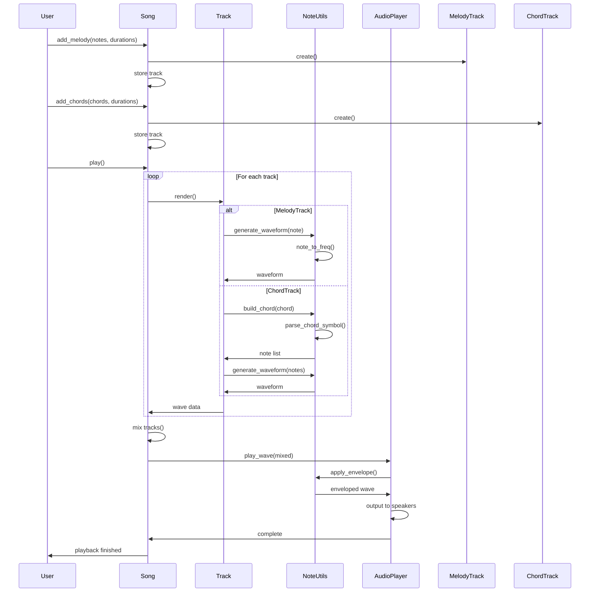
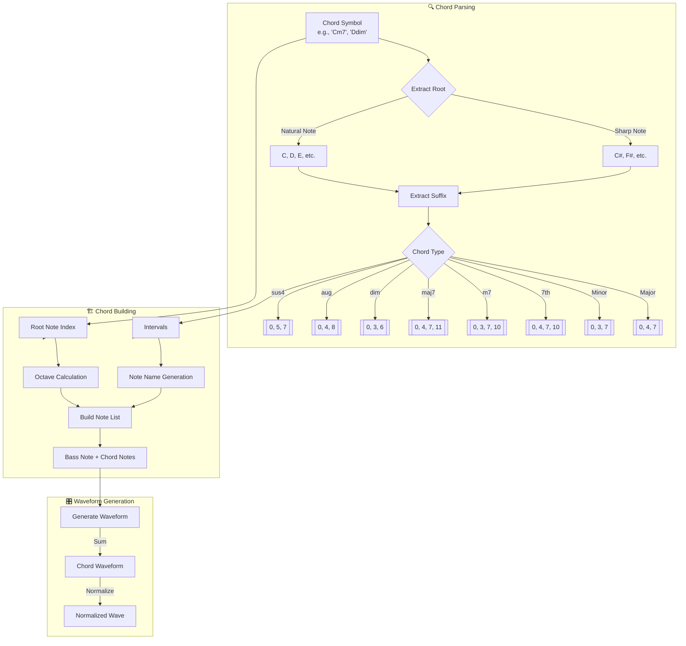
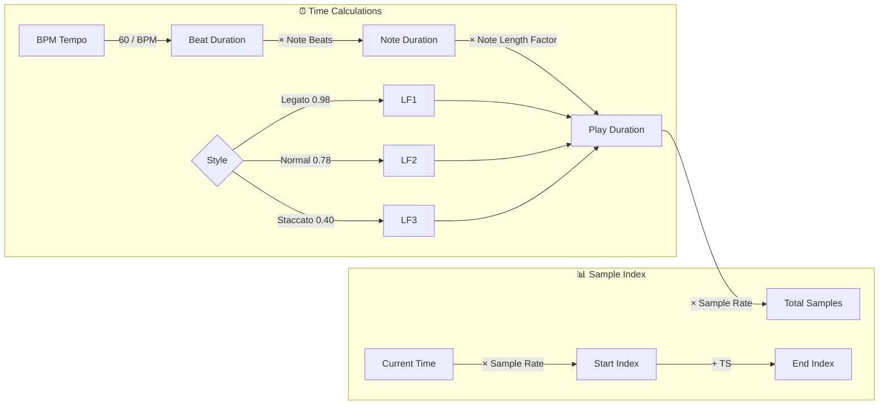
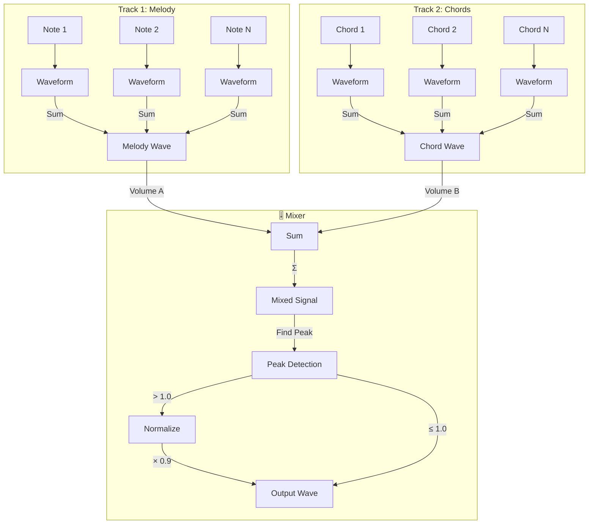
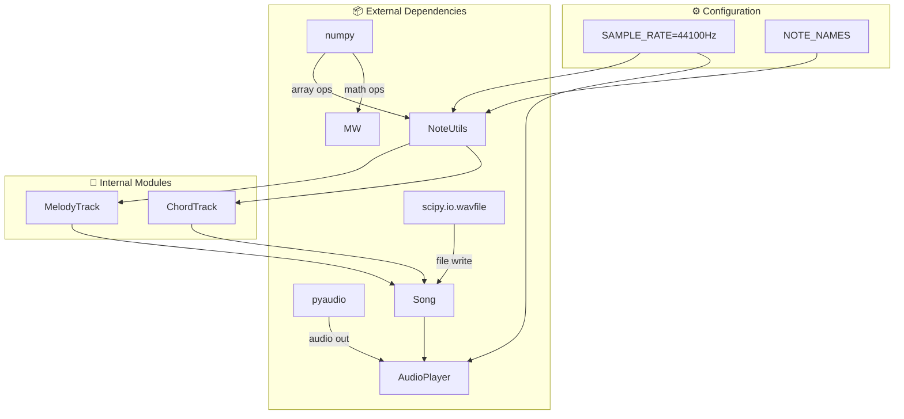
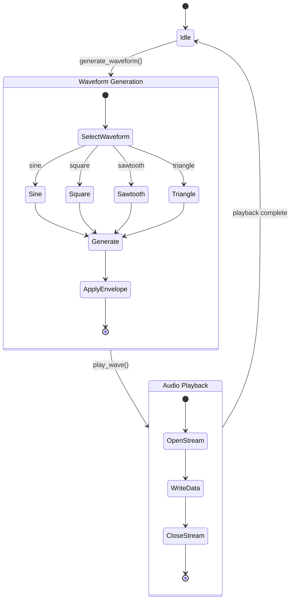
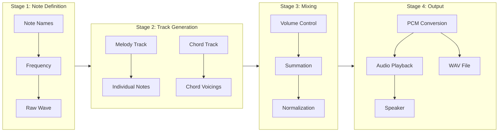

# Multi-track Wave Sound Generator - Documentation

## 📊 System Architecture Flowchart

## 📈 Class Hierarchy Diagram

## 🔄 Audio Generation Process Flow

## 🎵 Note Processing Sequence

## 🎸 Chord Processing Flow

## ⏱️ Timing and Duration Calculation

## 🎛️ Audio Mixing Process

## 📦 Module Dependency Graph

## 🔧 Waveform Generation States

## 📋 Processing Pipeline Summary

## メモ

再生中にノイズはいるようになり、OS再起動でなおった
ganttチャートでピアノロールのようにできる？

